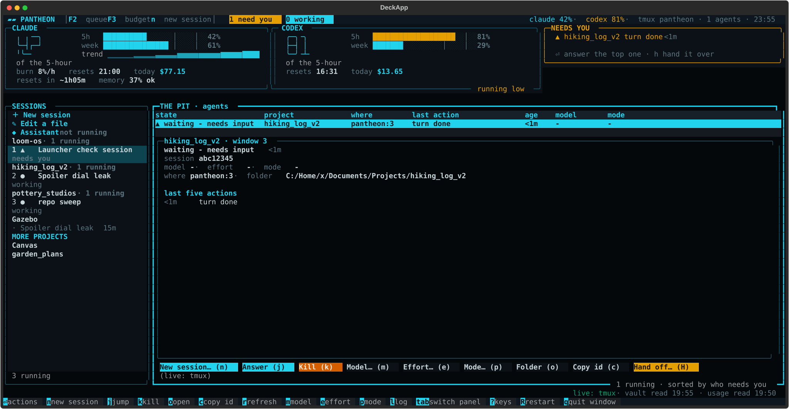

# Pantheon

A terminal command deck for running several coding agents at once. It shows every Claude Code and Codex session, who is waiting on you, how much of your usage window is left, and your task list, on one screen inside tmux.



## Why

When I run several agents in parallel on a subscription plan, the hard part is keeping track of which session needs an answer, how fast I'm burning through the 5-hour and weekly limits, and what to hand out next. My tasks already live in an Obsidian vault, so Pantheon reads them from there instead of asking me to keep a second tracker.

## Features

- **THE PIT**: a live table of every Claude Code session and Codex job with its state, project, last action and age. Sessions waiting on you are flagged from Claude Code's own hook events, not guessed from silence. Jump to, answer, kill, or hand off any session from its row.
- **Sessions**: your projects with their running and finished conversations. Start a new session with the model, effort and permission mode already set, or schedule one for later.
- **Queue**: your task list read straight from an Obsidian vault (task notes plus a `.base` file for the tabs), or from a plain Markdown folder. Pick a task and launch an agent on it with a briefing built from the note.
- **Budget**: 5-hour and weekly usage, burn rate, time to the limit and cost per day, built from local logs and Claude Code's status line. No reverse-engineered API calls.
- **Assistant**: an always-on session pinned in its own window, reachable from your phone through Claude's Remote Control.
- Works on a desktop monitor and, in a narrower layout, from a phone over SSH.

## Requirements

- Windows 10/11 with [MSYS2](https://www.msys2.org/) and its `tmux` (`pacman -S tmux`)
- MSYS2's Python 3.12 (Git Bash and Windows Python are not supported)
- [Claude Code](https://docs.claude.com/en/docs/claude-code)
- Optional: [Codex CLI](https://github.com/openai/codex), [ccusage](https://github.com/ryoppippi/ccusage), Windows Terminal, an Obsidian vault

## Install

From an MSYS2 shell:

```
git clone https://github.com/dtiger1889-ops/pantheon.git
cd pantheon
python -m venv --copies .venv
.venv/bin/python -m pip install -r requirements.txt
```

## Configure

Run `bin/pantheon` once and a first-run wizard asks for your vault folder, projects folder and tmux session name, then writes `pantheon.toml`. Every other setting is documented in `pantheon.example.toml`.

To feed THE PIT and the Budget card, register these in `~/.claude/settings.json` (each file's header shows how):

- `hooks/pantheon_event.ps1` as a hook for SessionStart, PostToolUse, Stop, SessionEnd, Notification and PermissionRequest
- `bin/statusline_capture` as the `statusLine` command

## Usage

```
bin/pantheon              # start or attach the deck
bin/pantheon --keys       # list every key
bin/pantheon --restart    # restart the deck windows; agent sessions keep running
```

Tests: `.venv/bin/python -m pytest -q`

## Known issues

- The tmux server has frozen a few times under MSYS2 during window resizes and restarts. The cause isn't known yet.
- Codex's interactive screen doesn't run under MSYS2 ([openai/codex#6994](https://github.com/openai/codex/issues/6994)), so Codex runs headless or in a separate Windows Terminal window.
- The limit governor, the planning card, answering permission prompts from the deck, and the assistant window are built but not yet tested in daily use. The governor ships switched off.
- Handing a session off to the other agent depends on two helper scripts that aren't included yet, so that path reports it couldn't run.
- The queue's tabs expect the task fields `next`, `agent`, `tier`, `status` and `complexity`. A different schema means editing `pantheon/queue/filters.py`.

## Related

- [agent-deck-comparison](https://github.com/dtiger1889-ops/agent-deck-comparison): Pantheon next to Orca, VelaTerm, Paseo and other agent managers.

## License

MIT. See `LICENSE`.
